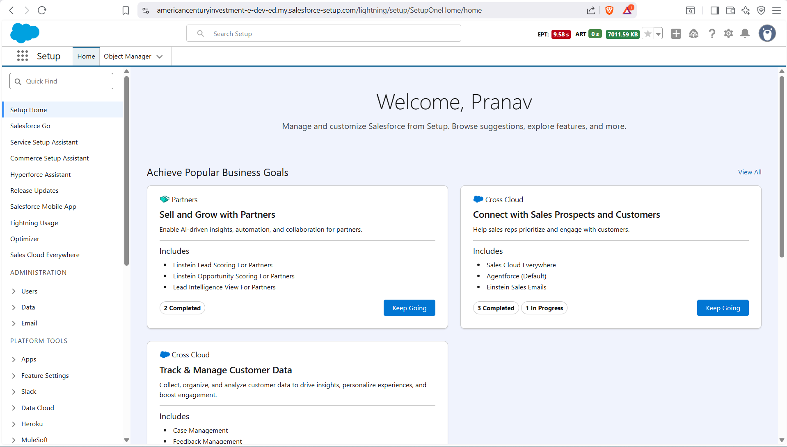

What is CRM?  
-- Any application/software that helps automate or digitise marketing functions can be called CRM (Customer Relationship Management)  
-- It is used to increase profits and maximise revenues  

